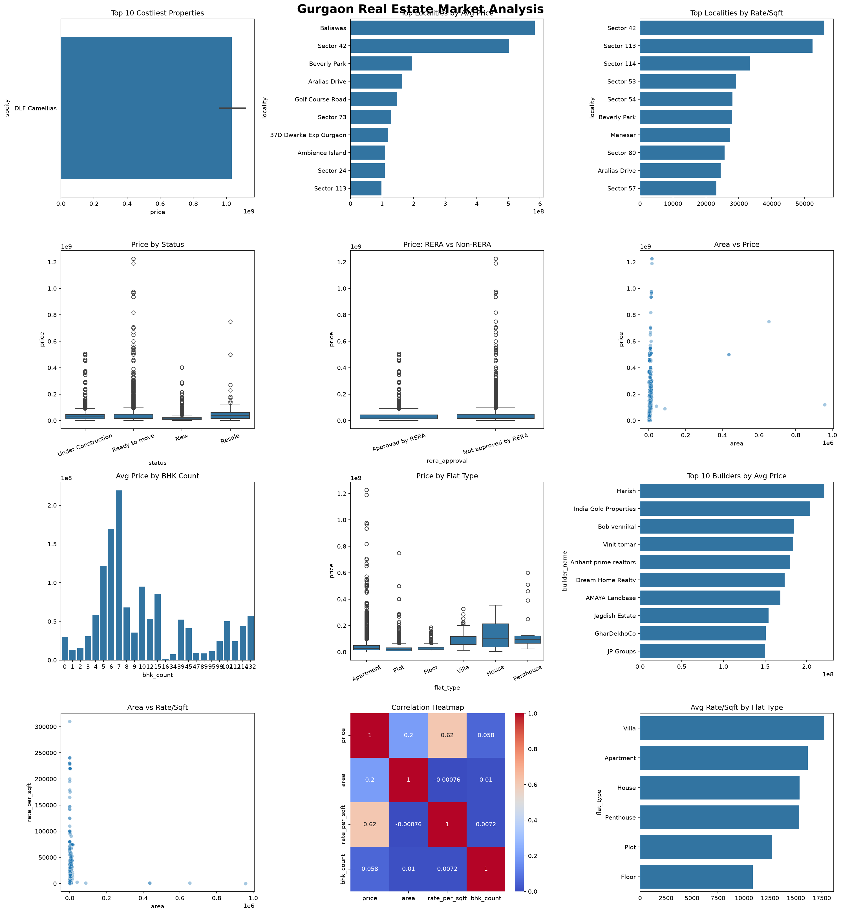

# Gurgaon Real Estate Market Analysis – Python

An exploratory data analysis (EDA) project focused on understanding the Gurgaon real estate market using Python, Pandas, Matplotlib, and Seaborn.

## 📌 Project Overview

This project analyzes real estate listings in Gurgaon to identify pricing patterns, locality-wise differences, property characteristics, builder performance, and relationships between property area, price, BHK count, and price per square foot.

The analysis includes data cleaning, preprocessing, aggregation, statistical exploration, and visualization.

## 🎯 Objectives

- Identify the most expensive properties
- Find localities with the highest average property prices
- Compare rate per square foot across localities
- Analyze prices by property status
- Compare RERA-approved and non-RERA-approved properties
- Study the relationship between area and price
- Analyze average price by BHK count
- Compare prices across different property types
- Identify builders with the highest average property prices
- Analyze the relationship between area and rate per square foot
- Identify correlations among key numerical variables
- Compare average rate per square foot across property types

## 🧹 Data Cleaning & Preprocessing

The dataset was cleaned using Pandas by:

- Standardizing column names
- Removing duplicate records
- Cleaning currency symbols and commas from price-related columns
- Converting price fields to numeric data types
- Converting BHK count to integer format
- Converting rate per square foot to numeric format
- Exporting the cleaned dataset for further analysis

## 🛠️ Tools & Technologies

- Python
- Pandas
- Matplotlib
- Seaborn
- Jupyter Notebook / Python Environment

## 📊 Visualizations

The analysis contains 12 visualizations:

1. Top 10 Costliest Properties
2. Top Localities by Average Price
3. Top Localities by Rate/Sqft
4. Price Distribution by Property Status
5. Price: RERA vs Non-RERA
6. Area vs Price
7. Average Price by BHK Count
8. Price by Flat Type
9. Top 10 Builders by Average Price
10. Area vs Rate/Sqft
11. Correlation Heatmap
12. Average Rate/Sqft by Flat Type

## 📷 Project Preview

## 📁 Files Included

- `data.csv` — Original dataset
- `cleaned_data.csv` — Cleaned dataset after preprocessing
- `data_cleaning-Dashboard.py` — Python script used for cleaning, analysis, and visualization
- `gurgaon_analysis_dashboard.png` — Final visualization output

## 🔍 Key Analysis Areas

### Property Pricing
Identified the costliest properties and compared average prices across different localities.

### Locality Analysis
Analyzed which Gurgaon localities have higher average property prices and higher rate per square foot.

### Property Characteristics
Compared property prices based on BHK count and property/flat type.

### RERA & Property Status
Explored price distributions across RERA approval status and property construction status.

### Price Relationships
Investigated relationships between:
- Area and Price
- Area and Rate/Sqft
- Price and BHK Count
- Other numerical variables through correlation analysis

## 💡 Key Learning

This project helped me practice the complete Python-based data analysis workflow:

**Data Cleaning → Data Transformation → Exploratory Data Analysis → Visualization → Insight Generation**

It also strengthened my understanding of Pandas, grouping and aggregation, statistical comparisons, and data visualization using Matplotlib and Seaborn.

## 👤 Author

**Mohd Amaan**

GitHub: [mohdamaan8954](https://github.com/mohdamaan8954)

